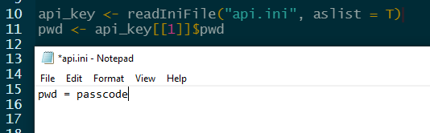
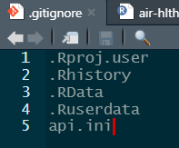

# This is the pipeline to blend PM2.5 models and data for CAR Fire Smoke v1.2

ivanhanigan

## Instructions for API key

First get the pass code from the data owner.

Then create a plain file called `api.ini` and add the following code to the `_targets.R` file:

Then add it to your `.gitignore` file too

